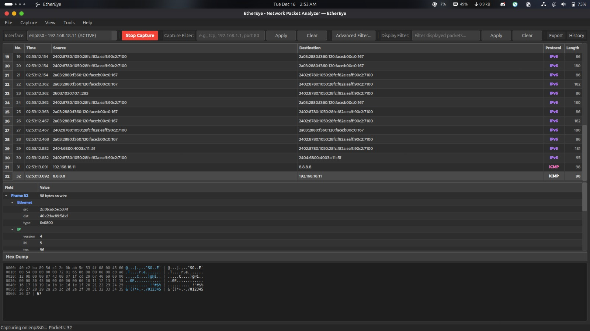

# EtherEye - Network Packet Analyzer

A powerful packet sniffer and network analysis tool with a modern GUI interface.

<p align="center">
  
</p>

## Features

- **Real-time Packet Capture**: Capture network traffic on any interface
- **Protocol Decoding**: Support for Ethernet, IP, TCP, UDP, ICMP, ARP, and more
- **Advanced Filtering**: BPF syntax and display filters
- **Session Management**: Save and load capture sessions
- **Export Capabilities**: Export to PCAP, CSV, JSON, and TXT formats
- **Dark Theme**: Modern, dark-themed UI for comfortable use
- **History Log**: Automatic session history with SQLite storage

## Requirements

- Python 3.8+
- PyQt6
- Scapy
- SQLite3 (included with Python)

## Installation

1. Clone the repository:
```bash
git clone https://github.com/YOUR_USERNAME/EtherEye.git
cd EtherEye
```

2. Install dependencies:
```bash
pip install -r requirements.txt
```

3. Run as root (required for packet capture):
```bash
sudo python main.py
```

## Usage
1. Launch the application: sudo python main.py

2. Select a network interface from the dropdown

3. Click "Start Capture" to begin capturing packets

4. Use filters to focus on specific traffic

5. Click on packets to view detailed information

6. Export sessions using the File menu

```text
EtherEye/
├── core/           # Core functionality
├── gui/            # User interface components
├── models/         # Data models
├── utils/          # Utility classes
├── main.py         # Application entry point
└── README.md       # This file
```



## License
This project is licensed under the MIT License - see the LICENSE file for details.

